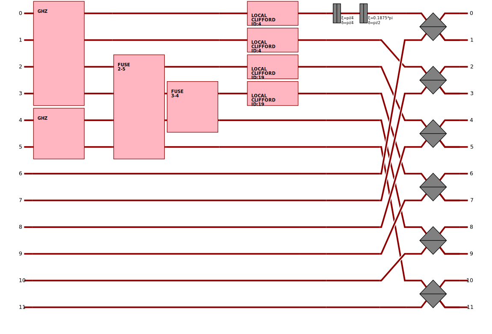

Tutorial
========

In this tutorial, we will learn how to use the `graphix-perceval` library to convert
`graphix.Pattern <https://graphix.readthedocs.io/en/latest/modifier.html#graphix.pattern.Pattern>`_
objects into `perceval.Circuit <https://perceval.quandela.net/docs/reference/circuit.html>`_ objects.

Installation
------------

First, we need to install the `graphix-perceval` library. This can be done using `pip`:

.. code-block:: bash

    pip install graphix-perceval

If you have not installed `graphix` yet, you can install it using `pip` as well:

.. code-block:: bash

    pip install graphix

Generating MBQC Pattern
-----------------------

We first generate an MBQC pattern using ``graphix`` library.
First, let us import relevant modules and define the function we will use:

.. code-block:: python

    from graphix import Circuit
    import numpy as np
    import matplotlib.pyplot as plt
    import networkx as nx

    # define a simple circuit
    def simple_circ(circuit: Circuit):
        circuit.h(1)
        circuit.h(2)
        circuit.cnot(0, 1)
        circuit.cnot(0, 2)

Then we define a circuit:

.. code-block:: python

    # generate the GHZ state generation pattern
    circuit = Circuit(3)
    simple_circ(circuit)
    pattern = circuit.transpile()

    # plot the pattern
    nodes, edges = pattern.get_graph()
    g = nx.Graph()
    g.add_nodes_from(nodes)
    g.add_edges_from(edges)
    np.random.seed(100)
    nx.draw(g)
    plt.show()

Pattern-to-circuit conversion
-----------------------------

Now let us convert the pattern into a circuit using the `graphix-perceval` library:

.. code-block:: python

    from graphix_perceval import to_perceval
    from perceval import pdisplay

    exp = to_perceval(pattern)
    pdisplay(exp.circ)

Running pattern on Perceval simulator
-------------------------------------

By running Perceval's computing backends, we can obtain the probability distribution of the measurement outcomes

.. code-block:: python

    exp.set_local_processor("SLOS")
    dist = exp.get_probability_distribution()
    dist.draw()

.. raw:: html

    <table>
    <thead>
    <tr><th>state  </th><th style="text-align: right;">  probability</th></tr>
    </thead>
    <tbody>
    <tr><td>|000&gt;  </td><td style="text-align: right;">          0.5</td></tr>
    <tr><td>|111&gt;  </td><td style="text-align: right;">          0.5</td></tr>
    </tbody>
    </table>
     

or sampling distribution with a given number of samples:

.. code-block:: python

    exp.set_local_processor("SLOS")
    dist = exp.sample(num_samples=1000)
    dist.draw()

.. raw:: html

    <table>
    <thead>
    <tr><th>state  </th><th style="text-align: right;">  counts</th></tr>
    </thead>
    <tbody>
    <tr><td>|000&gt;  </td><td style="text-align: right;">     499</td></tr>
    <tr><td>|111&gt;  </td><td style="text-align: right;">     501</td></tr>
    </tbody>
    </table>
     

.. note::
    Note that the current implementation only supports ``SLOS`` and ``Naive`` as local Perceval processors.
    See `Perceval documentation <https://perceval.quandela.net/docs/backends.html>`_ for more details.

